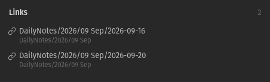

# Date Linker
Frontmatter of a note can contain date information, which Obsidian can display as either a "Date" or "Date & Time" type. 
Date Linker enables the creation of links to corresponding daily notes from these dates in the frontmatter of a note. 
These links are created as a seperate frontmatter property. From there, they're picked up by Obsidian which leads to them being handled like every other link in your Vault.

# Setup & Usage
Date Linker does nothing until explicitly configured. 
Linking behaviour for a note is configured by setting `DL-watchedProperties` as a frontmatter property in the note (property name can be changed in the settings). 
Date Linker will try to create links for every property listed in `DL-watchedProperties`.
The values need to follow [ISO 8601](https://de.wikipedia.org/wiki/ISO_8601) in order to be parseable.
Basically: If Obsidian detects them as a date (and displays them as such in the preview mode), Date Linker will be able to work with it.

There are two ways to trigger link creation from these watched properties:
1. Using the command palette
	
	There are two commands to either update the managed relations of the currently active file or to update the managed relations of all files in the vault. 
	They're named `Update managed relations for this file` and `Update managed relations for all files` accordingly. 
	This is mainly useful during setup, allowing you to better understand it's behaviour before letting it loose on your whole vault.

2. Automatically updating on frontmatter change

	When enabling `Automatically update managed relations when frontmatter updates` in the settings, Date Linker will automatically watch for frontmatter changes and update the managed links accordingly. 
	The same behaviour can be achieved by using the command `Update managed relations for this file` every time after changing the frontmatter of a file.

In order to create the links, the plugin creates it's own frontmatter field named `DL-managedRelations` (this default can also be changed in the settings).

---
> Example 
> 
> Let's say you have a note with the following frontmatter:
> ```md
> aliases:
> created: 2026-09-15T19:27:41Z
> started: 2026-09-16T20:53:04Z
> completed: 2026-09-20
> tags:
>   - testNote
>   - plugin
>   - development
> ```
> You might want to link the corresponding daily note for the `started` and `completed` property, but not for `created`. So we add the following to the frontmatter:
> ```md
> DL-watchedProperties:
>   - started
>   - completed
> ```
> After using the `Update managed relations for this file` command (or when `Automatically update managed relations when frontmatter updates` is already enabled), a new property field is added by DateLinker:
> ```md
> DL-managedRelations:
>   - property: started
> 	link: "[[2026-09-16]]"
>   - property: completed
> 	link: "[[2026-09-20]]"
> ```
> The outgoing links now show the connection:
> 
> 
---

This configuration on a per-note level is well suited for workflows that include templated note creation. 
Just add `DL-watchedProperties` in your template and Date Linker will insert the links after a note was created from the template.

# Additional features I currently plan to work on
- Globally watched properties. Set properties which should always create a link to the daily note without them being listed as a watched property on a note-level.
- Ability to hide the managed relations field when not in source mode. There are already other plugins which can hide frontmatter fields and as far as I know, it only requires a bit of css.
